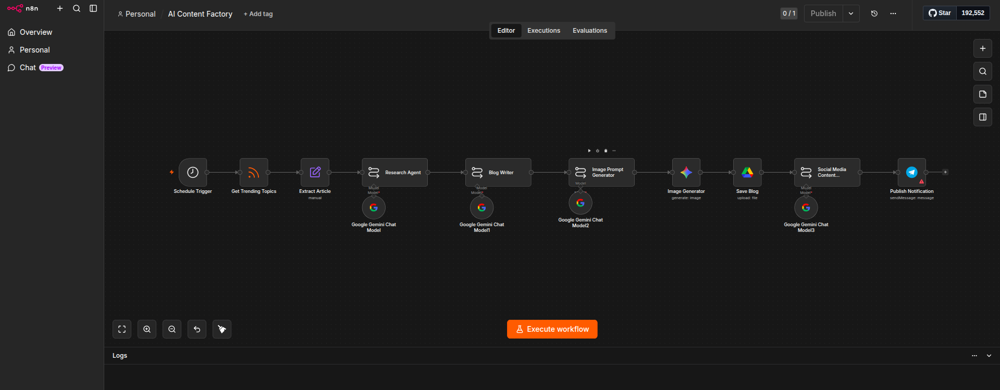

# 🚀 AI Content Factory

<p align="center">


</p>

An end-to-end **AI-powered content automation workflow** built with **n8n** that automatically discovers trending topics, performs AI research, generates SEO-optimized blog articles, creates AI image prompts, produces social media content, and organizes generated assets for publishing.

---

# 📖 Overview

## Problem

Creating high-quality digital content consistently requires significant manual effort. Content creators spend hours researching topics, writing articles, designing graphics, and preparing content for multiple platforms.

## Solution

AI Content Factory automates the entire content production pipeline using **n8n**, **Google Gemini AI**, **RSS Feeds**, **Google Drive**, and **Telegram**. The workflow transforms trending articles into a complete content package ready for publishing across multiple platforms.

---

# ✨ Features

## 📰 Content Discovery

- Automatically monitor RSS feeds
- Discover trending articles
- Extract article metadata
- Prepare content for AI processing

## 🤖 AI Content Generation

- AI-powered research and analysis
- SEO-optimized blog generation
- AI image prompt generation
- Social media caption creation

## 📁 Content Management

- Automatically upload assets to Google Drive
- Organize generated files
- Archive blog assets
- Maintain structured content storage

## 📢 Notifications

- Telegram notifications after workflow completion
- Automation monitoring
- Status reporting

---

# 🏗 Workflow Architecture

```text
                          🚀 AI CONTENT FACTORY

┌─────────────────────────────────────────────────────────────┐
│                 CONTENT DISCOVERY                           │
└─────────────────────────────────────────────────────────────┘

      Schedule Trigger
              │
              ▼
      RSS Feed Reader
              │
              ▼
      Prepare Article Data

                      │
                      ▼

┌─────────────────────────────────────────────────────────────┐
│                AI CONTENT GENERATION                        │
└─────────────────────────────────────────────────────────────┘

        AI Research Agent
              │
              ▼
        SEO Blog Writer
              │
              ▼
   AI Image Prompt Generator
              │
              ▼
      AI Image Generator

                      │
                      ▼

┌─────────────────────────────────────────────────────────────┐
│                 CONTENT MANAGEMENT                          │
└─────────────────────────────────────────────────────────────┘

 Upload Assets to Google Drive
              │
              ▼
 Archive Generated Content

                      │
                      ▼

┌─────────────────────────────────────────────────────────────┐
│               CONTENT DISTRIBUTION                          │
└─────────────────────────────────────────────────────────────┘

 Social Media Content Generator
              │
              ▼
 Send Telegram Notification
```

---

# 📸 Workflow Screenshot

<p align="center">

</p>

---

# 🛠 Tech Stack

## 🤖 Workflow Automation

- n8n

## 🧠 Artificial Intelligence

- Google Gemini AI

## 🔗 APIs & Integrations

- RSS Feed
- Google Drive API
- Telegram Bot API

## 💻 Programming

- JavaScript

---

# 📂 Repository Structure

```text
AI-Content-Factory/

│
├── README.md
├── LICENSE
│
├── workflow/
│   └── workflow.json
│
└── images/
    └── workflow.png
```

---

# ⚙️ Setup Guide

## 1. Clone Repository

```bash
git clone https://github.com/belioautomation/AI-Content-Factory-n8n.git
```

---

## 2. Import Workflow

Import the workflow into your n8n instance.

```text
workflow/workflow.json
```

---

## 3. Configure Credentials

Configure the following credentials inside n8n:

- Google Gemini API
- Google Drive OAuth2
- Telegram Bot
- RSS Feed

---

## 4. Update Configuration

Modify:

- RSS feed sources
- Google Drive destination folders
- Telegram Chat ID
- AI prompts (optional)

---

## 5. Activate Workflow

Enable the workflow and monitor its first execution.

---

# 📊 Workflow Output

```text
Trending Article
        │
        ▼
AI Research Summary
        │
        ▼
SEO Blog Article
        │
        ▼
AI Image Prompt
        │
        ▼
Generated Cover Image
        │
        ▼
Google Drive Storage
        │
        ▼
Social Media Content
        │
        ▼
Telegram Notification
```

---

# 💡 Skills Demonstrated

- AI Workflow Automation
- Prompt Engineering
- SEO Content Generation
- API Integration
- Google Workspace Automation
- JavaScript Data Transformation
- Digital Asset Management
- Multi-step Business Automation

---

# 🔮 Future Improvements

- WordPress Auto Publishing
- LinkedIn Publishing
- Facebook Publishing
- AI SEO Optimization
- AI Plagiarism Detection
- Content Analytics Dashboard
- Multi-language Content Generation
- AI Video Generation

---

# 👨‍💻 Author

**Belio C. Sinangote**

BS Information Technology Student  
Cebu Technological University

GitHub: https://github.com/belioautomation

LinkedIn: https://linkedin.com/in/belio-sinangote-180375402

---

# 📄 License

This project is licensed under the **MIT License**.

---
